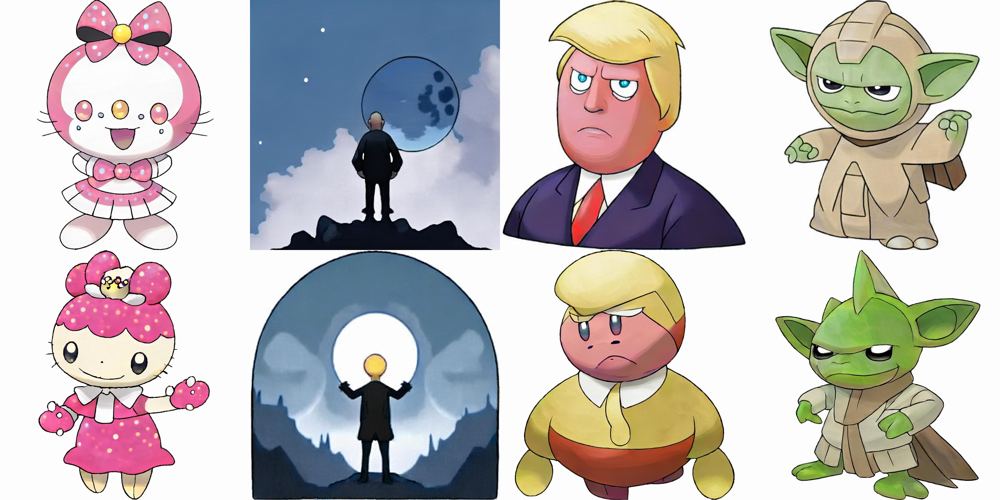

Update stage C training script for v2 model.

- download v2 pretrained models as in stage-C notebooks
- get a webdataset (.tar files for images and text files) (e.g. [justinpinkney/pokemon-blip-captions-wds](https://huggingface.co/datasets/justinpinkney/pokemon-blip-captions-wds))
- install repo

```
git clone https://github.com/VimukthiRandika1997/Wuerstchen.git
cd Wuerstchen
conda create --name w2 python=3.10.12
conda activate w2
pip install torch torchvision --index-url https://download.pytorch.org/whl/cu118
pip install -r requirements.txt
```

- edit parameters in `train_stage_C.py`
- run with torch run (e.g. `./go.sh`)
- testing on 2xA6000, with pokemon dataset, trains about 1.5 iterations/s

After 4750 iterations the outputs look like this (ema top, non-ema bottom):




## Original README


[](https://colab.research.google.com/drive/1KeN407dItcjLcWdMLrByZ8mPa1MT2_DJ?usp=sharing)
# Würstchen


## What is this?
Würstchen is a new framework for training text-conditional models by moving the computationally expensive text-conditional stage into a highly compressed latent space. Common approaches make use of a single stage compression, while Würstchen introduces another Stage that introduces even more compression. In total we have Stage A & B that are responsible for compressing images and Stage C that learns the text-conditional part in the low dimensional latent space. With that Würstchen achieves a 42x compression factor, while still reconstructing images faithfully. This enables training of Stage C to be fast and computationally cheap. We refer to [the paper](https://arxiv.org/abs/2306.00637) for details.

## Use Würstchen
You can use the model simply through the notebooks here. The [Stage B](https://github.com/dome272/wuerstchen/blob/main/w%C3%BCrstchen-stage-B.ipynb) notebook only for reconstruction and the [Stage C](https://github.com/dome272/wuerstchen/blob/main/w%C3%BCrstchen-stage-C.ipynb) notebook is for the text-conditional generation. You can also try the text-to-image generation on [Google Colab](https://colab.research.google.com/drive/1KeN407dItcjLcWdMLrByZ8mPa1MT2_DJ?usp=sharing).

### Using in 🧨 diffusers

Würstchen is fully integrated into the [`diffusers` library](https://huggingface.co/docs/diffusers). Here's how to use it:

```python
# pip install -U transformers accelerate diffusers

import torch
from diffusers import AutoPipelineForText2Image
from diffusers.pipelines.wuerstchen import DEFAULT_STAGE_C_TIMESTEPS

pipe = AutoPipelineForText2Image.from_pretrained("warp-ai/wuerstchen", torch_dtype=torch.float16).to("cuda")

caption = "Anthropomorphic cat dressed as a fire fighter"
images = pipe(
    caption,
    width=1024,
    height=1536,
    prior_timesteps=DEFAULT_STAGE_C_TIMESTEPS,
    prior_guidance_scale=4.0,
    num_images_per_prompt=2,
).images
```

Refer to the [official documentation](https://huggingface.co/docs/diffusers/main/en/api/pipelines/wuerstchen) to learn more.

## Train your own Würstchen
Training Würstchen is considerably faster and cheaper than other text-to-image as it trains in a much smaller latent space of 12x12.
We provide training scripts for both [Stage B](https://github.com/dome272/wuerstchen/blob/main/train_stage_B.py) and [Stage C](https://github.com/dome272/wuerstchen/blob/main/train_stage_C.py).

## Download Models
| Model           | Download                                             | Parameters      | Conditioning                       | Training Steps | Resolution |
|-----------------|------------------------------------------------------|-----------------|------------------------------------|--------------------|------|
| Würstchen v1    | [Huggingface](https://huggingface.co/dome272/wuerstchen) | 1B (Stage C) + 600M (Stage B) + 19M (Stage A)  | CLIP-H-Text | 800.000| 512x512 |
| Würstchen v2    | [Huggingface](https://huggingface.co/dome272/wuerstchen) | 1B (Stage C) + 600M (Stage B) + 19M (Stage A)  | CLIP-bigG-Text | 918.000| 1024x1024 |

## Acknowledgment
Special thanks to [Stability AI](https://stability.ai/) for providing compute for our research.
